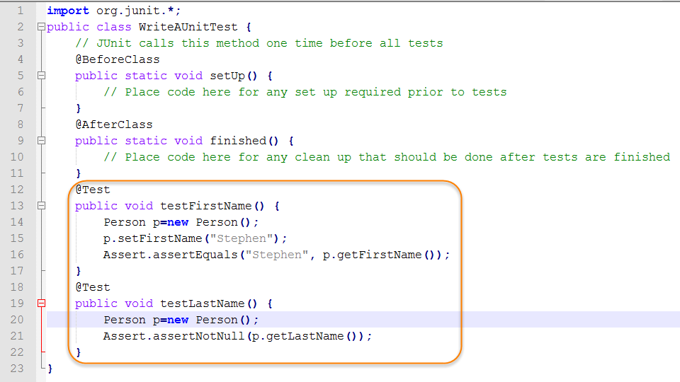

C'est quoi "un test unitaire" ?
=========================

*Presentation entre 3 et 5 minutes à l'oral*

## Brouillon
Le test unitaire est un moyen de vérifier qu'un extrait de code fonctionne correctement. C'est l'une des procédures mises en oeuvre dans le cadre d'une méthodologie de travail agile.

Le test unitaire consiste à isoler une partie du code et à vérifier qu'il fonctionne parfaitement. Il s'agit de petits tests qui valident l'attitude d'un objet et la logique du code.

Les tests unitaires sont généralement effectués pendant la phase de développement des applications. Ces tests sont normalement effectués par les développeurs, bien qu'il puissent également être effectués par les responsables en assurance QA.

Test unitaire révèle si la logique derrière le code est appropriée et fonctionnera dans tous les cas. Il permettent de mieux comprendre le code. ça peut être également une ressource supplémentaire pour la documentation du projet.

Test unitaire est une procédure permettant de vérifier le bon fonctionnement d'une partie précise d'un logiciel ou d'une portion d'un programme.

Test unitaire permettent de vérifier le bon fonctionnement d'une petite partie bien précise d'une application. Permet par exemple de tester qu'une méthode fonctionne correctement dans les différents cas de figures.

Test unitaire est à la base des autres processus de test (test fonctionnels, test d'intégration etc...). C'est à la base de la Pyramide des tests.

 (source image : https://practicalprogramming.fr/tests-unitaires)

Permet de vérifier si programme fontionne toujours comme prévu marlgé les évolutions du code. Grâce aux tests unitaire, je me protège également des futures évolutions de mon code.

Test unitaire est une suite d'opérations permettant de vérifier la validité d'unités individuelles d'une application (plus petite unité du code source, par exemple fonction, méthode de calsse, un module, un objet... => test "bas niveau", à la différence des test "haut niveau" qui controlent la validité de plsueurs fonctionnalités complète), indépendamment les une des autres. Scope fonction publique. Si test échoue à la suite d'une mise à jour du code source, il en sera avertit et pourra corriger le problème.

Test unitaire sont écrit soit par le développeur, ou par une autre personnes (avant, pendant ou après le développement de l'applicationi).

Mocks / Stubs ?

Ecrit test pour confronter une réalisation à sa spécification. Le test définit un critère d'arrêt (êtat ou sorties à l'issue de l'exécution) et permet de statuer sur le succès ou sur l'échec d'une verification. Test permet de vérifier que la relation d'entrée / sortie donnée par la spécification est bel et bien réalisé.

Utile pour le Test Diven Development (TDD) ou l'intégration continue (DevOps).

Les test unitaires doivent être rejoué après une modification ducode afin de vérifier qu'il n'y a pas de régressions.

1. Inititalisation du test
2. Exercice, lancer le test pour executer le code
3. Vérification du test
4. desactivation du test

Utilité des tests unitaires : tester les bugs & tester si composant resepcter bien les spécifications.

Test unitaire pilier méthodologie Scrum et autre méthodes agile de développemet (TDD, Test Driver Development et XP, Extreme Programming). Encouragé à écrire avant de développer application pour s'en service comme une spécification avant de produire le code.

### TDD
Test Driver Development consiste à élaborer les procédures de test unitaires à éxécuter sur l'élément logiciel avant d'écrire le code du logiciel.
Donc une exigence est choisie à partir d'une liste d'une liste d'exigences et un test est établie et effectué pour vérifier ce qui pourrait aller mal.
Le développement est donc effectué conformément aux exigences d'un cahier des charges ou des spécifications.

### XP
Extreme Programming. Méthode agile de gestion de projet informatique adapté petites équipes. Elle pousse à l'extreme le développement agile, c'est à dire 

### Java
JUnit.

 (Source image https://www.webucator.com/how-to/how-write-unit-test-java.cfm)

## Sources
- https://fr.wikipedia.org/wiki/Test_unitaire
- https://practicalprogramming.fr/tests-unitaires
- https://fr.yeeply.com/blog/test-unitaire-comment-sy-prendre/

## Outils
- Presentation (alternative à PowerPoint) : https://github.com/impress/impress.js/